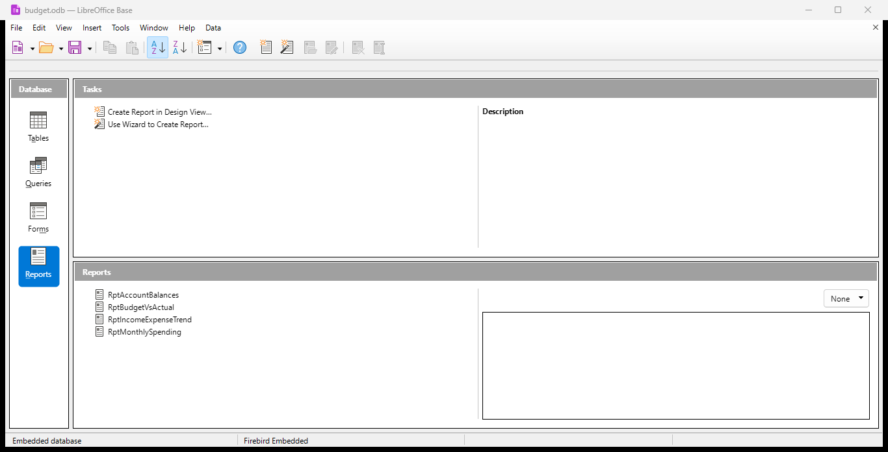

Project: Personal Budget Application (LibreOffice Base + Calc)
Objective: Build a personal budget management application using LibreOffice Base, backed by a .odb database file named budget.odb. Table structure should be prototyped first in a Calc spreadsheet (personal_budget.ods) before being implemented as actual database tables.

## Download

Grab the ready-to-use database from the latest release — no cloning or building required:

**[⬇ Download budget.odb (latest)](https://github.com/davidjayjackson/base_personal_budget/releases/latest/download/budget.odb)** · [all releases](https://github.com/davidjayjackson/base_personal_budget/releases/latest)

Open it in LibreOffice Base (6.1+, embedded Firebird) to use the tables, forms, and reports.

Deliverables

personal_budget.ods — a Calc workbook where each sheet represents the layout/schema of one database table (column headers, data types noted, sample rows). This is the design reference, not the live data.
budget.odb — the LibreOffice Base database file containing:

Tables (built from the .ods layouts)
Primary keys and indexes
Relationships (foreign keys) between tables
Data entry/display forms
Finished reports

Supporting documentation (README) explaining the schema, relationships, and how to use the forms/reports.

Suggested Database Tables (to define in personal_budget.ods first)

Accounts — bank/credit accounts (id, name, type, starting_balance)
Categories — spending categories (id, name, parent_category_id for sub-categories)
Transactions — individual income/expense entries (id, date, account_id, category_id, amount, description, type)
Budgets — planned monthly amounts per category (id, category_id, month, planned_amount)
RecurringTransactions — templated recurring bills/income (id, description, amount, frequency, category_id, account_id, next_due_date)

(Adjust/add tables as needed — this is a starting structure.)
Relationships

Transactions.account_id → Accounts.id
Transactions.category_id → Categories.id
Budgets.category_id → Categories.id
RecurringTransactions.account_id → Accounts.id
RecurringTransactions.category_id → Categories.id
Categories.parent_category_id → Categories.id (self-referencing, optional)

Forms Needed

Transaction entry form (add/edit/delete transactions, with dropdowns for account and category)
Account management form
Category management form
Recurring transaction setup form

Reports Needed

Monthly spending by category
Budget vs. actual spending
Account balance summary
Income vs. expense trend over time

Technical Notes for Implementation

Build tables via .odb HSQLDB/Firebird embedded engine (LibreOffice Base default)
Consider scripting table/form/report creation via the LibreOffice UNO API (Python) for reproducibility, since Base GUI work isn't easily version-controlled
Keep personal_budget.ods as the single source of truth for schema design — update it first, then regenerate/adjust the .odb tables to match

---

## Build & Regenerate (implemented)

`budget.odb` uses the embedded **Firebird** engine and is generated
reproducibly by the scripts in `scripts/`. Run each with LibreOffice's
bundled Python (it ships the `uno` module); close any interactive
LibreOffice first so the file isn't locked:

    "C:\Program Files\LibreOffice\program\python.exe" scripts\build_odb.py      # tables + seed data
    "C:\Program Files\LibreOffice\program\python.exe" scripts\build_reports.py  # report queries
    "C:\Program Files\LibreOffice\program\python.exe" scripts\build_forms.py    # data-entry forms

    "C:\Program Files\LibreOffice\program\python.exe" scripts\verify_odb.py     # tables/FK/CHECK checks
    "C:\Program Files\LibreOffice\program\python.exe" scripts\verify_forms.py   # form structure checks

Each build script spawns its own headless `soffice` on a private socket +
profile, so it won't disturb an interactive session.

### Tables
Accounts, Categories, Transactions, Budgets, RecurringTransactions — with
primary keys, the six foreign keys listed above, and CHECK constraints on
account type, category kind, transaction type and recurrence frequency.

### Forms (`build_forms.py`)
Each is an embedded form document with a data grid (add/edit/delete):

| Form               | Table                  | Notes                          |
| ------------------ | ---------------------- | ------------------------------ |
| `TransactionEntry` | Transactions           | Account + Category dropdowns   |
| `Accounts`         | Accounts               |                                |
| `Categories`       | Categories             | Parent-category dropdown       |
| `RecurringSetup`   | RecurringTransactions  | Account + Category dropdowns   |

### Reports (`build_reports.py` + Report Wizard)
The analytics live in Firebird **views**; each saved query is a thin
`SELECT * FROM <view>` wrapper. This matters: the Report Builder engine
re-processes a report's source SQL and errors on advanced SQL
(EXTRACT/CASE/COALESCE), so the views hide that complexity and the report
engine only ever sees a plain select.

| View / Query            | Report (Reports pane)   | Content                       |
| ----------------------- | ----------------------- | ----------------------------- |
| `RPT_MONTHLY_SPENDING`  | `RptMonthlySpending`    | Monthly spending by category  |
| `RPT_BUDGET_VS_ACTUAL`  | `RptBudgetVsActual`     | Budget vs. actual spending    |
| `RPT_ACCOUNT_BALANCES`  | `RptAccountBalances`    | Account balance summary       |
| `RPT_INCOME_EXPENSE_TREND` | `RptIncomeExpenseTrend` | Income vs. expense trend   |

The queries are viewable directly under **Queries**. The finished reports
in the **Reports** pane were generated with Base's Report Wizard on those
queries (Report Builder reports can't be created reliably via UNO — the
engine crashes; the wizard is stable). After creating reports in Base, you
must **save the main database window** (Ctrl+S) for them to persist.

